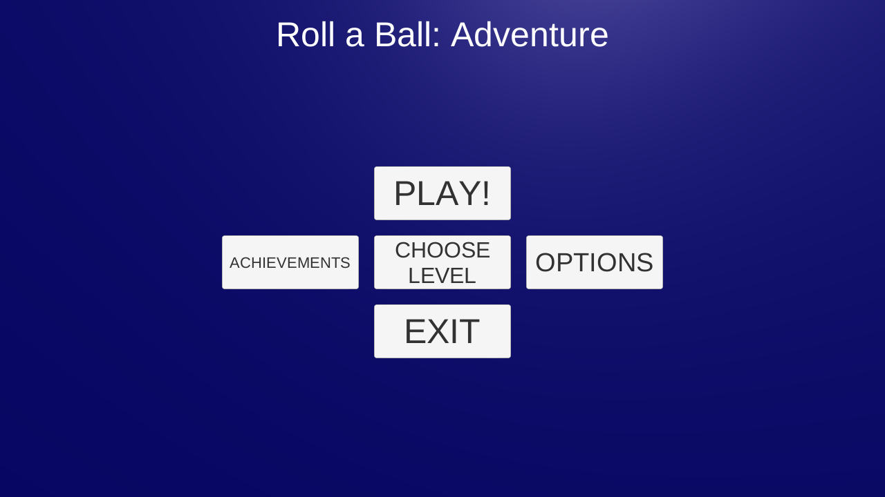
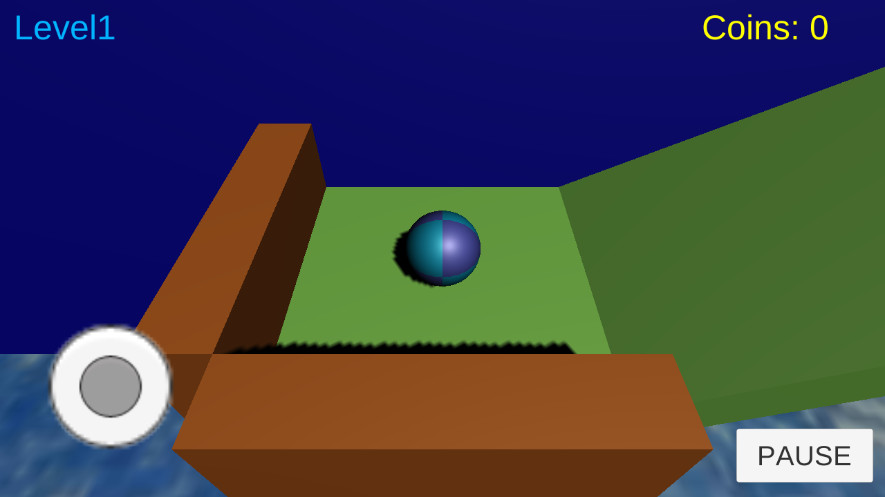
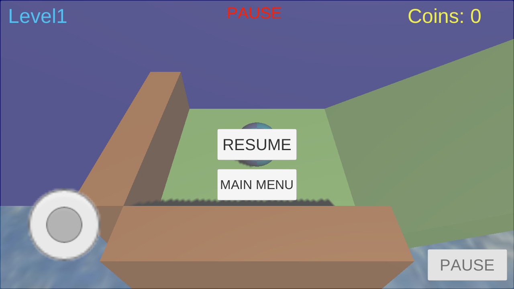

# Roll a Ball: Adventure

Android game made with Unity 3D.

## Table of Contents
* [General info](#general-info)
* [Technologies](#technologies)
* [Gameplay](#gameplay)
* [Links](#links)
* [Changelog](#changelog)

## General info 

This game is created with Unity 3D engine on Free License and this is non-profit project that tests gained programming experience in Unity 3D. Despite very simple graphics creating this game also gives fun and allows test all features Unity can offer. Scripts are written in C#.

## Technologies

Technologies used with this project:
* Unity version: 2019.1.4f1
* C#

## Gameplay

Roll a Ball: Adventure is a game inspired by Roll a Ball game created by Unity Technologies as a tutorial showing how to start creating games. This project, however, is more extensive and is still under development. In the game player is a ball character (as in title) which needs to go all way through and needs to watch out some obstacles during its journey, like chasms, sharp tools or moving parts. Player can also find coins that can be useful for unlocking new skins, for example. The whole game is created from scratch, only few textures are downloaded from the Internet (Links are available in [Links](#links) section).

Below pictures showing how game looks on Android device:

## Links

If you are interested in creating games in Unity 3D engine and you need to start from a simple project, please go to a Roll a Ball's tutorial available here: https://learn.unity.com/project/roll-a-ball-tutorial. Good luck!

Textures: https://opengameart.org/.

(Further links will appear later during game's development)

## Changelog

Version 1.0
* Removed Win Scene; changed with UI Panel instead additional scenes with win or lose
* Fixed size of buttons and its placement
* Improved scripts with options; changed many scripts with one - Options System
* Added buttons in Main Menu: Options and Achievements
* Improved HUD and Virtual Joystick on display

Version 0.1
* Main menu added
* First level added
* Coins added
* Virtual Joystick without camera rotating; camera goes after the player
* Pause menu system added
